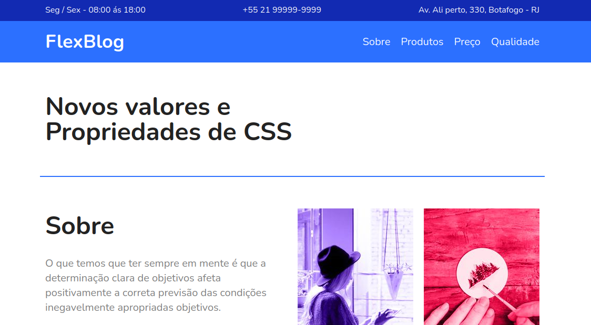

<h1 align="center">
  
</h1>

  <a href="#-tecnologias">Tecnologias</a>&nbsp;&nbsp;&nbsp;|&nbsp;&nbsp;&nbsp;
  <a href="#-projeto">Projeto</a>&nbsp;&nbsp;&nbsp;

 

  

## 🚀 Tecnologias

Esse projeto foi desenvolvido com as seguintes tecnologias:

- HTML
- CSS

## 💻 Projeto

O projeto FlexBlog foi desenvolvido no curso CSS Flexbox realizado através da plataforma Origamid, o principio era trabalhar com os conceitos de Flexbox, criando um site personalizado e responsivo.

---

Feito com 💜 👋 [Check out my LinkedIn](https://www.linkedin.com/in/william-souza-0967337b/)